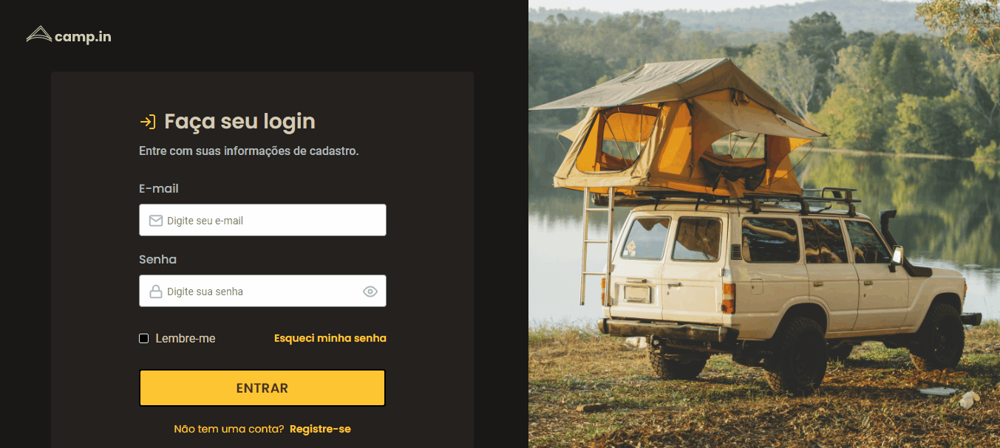

## 💻 Projeto

Projeto que consistiu em criar um formulário de login com alguns dinamismos com CSS.

## 🚀 Tecnologias

<ul>
  <li>HTML</li>
  <li>CSS</li>
</ul>

## 🔖 Layout do Projeto

O layout pode ser visto através do Figma

[Layout Web](https://www.figma.com/file/dWOMuXBzDmuAPlraNqDJJU/DD-%2F-Login-Form---CSS-(Copy)?node-id=216%3A2&t=hos1HJ3ooXcqNvO2-0)
